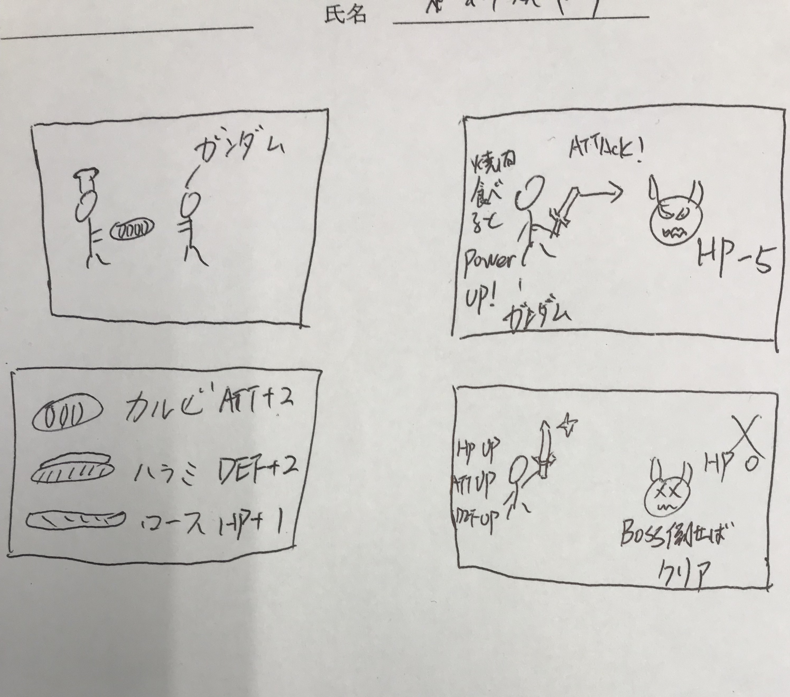

# 画面イメージ

ガンダム

# 操作方法
- Enter->開始　　X->キャンセル　　Z->攻撃    SPACE->jump  

# ターゲットデバイス（PC　or　スマホ）
-　PC

# （あれば）ゲームのストーリーや世界観

# ルール（ゲームオーバーの条件や、クリアの条件、得点の仕方、何を競うのか）
- 敵に攻撃されてHPが0になるとゲームオーバー
- 最後のBOSSを倒すとクリア

# 利用したアセットや素材の著作者、URL、利用条件
- いらすとや. https://www.irasutoya.com/
  - 何ができるのか？何ができないのか？使う上で必要な条件
  - 非商用利用なら、点数に関わらず、利用可能
  - ただし、以下は禁止
    - 公序良俗に反する目的での利用
    - 素材のイメージを損なうような利用
    - 素材自体をコンテンツ・商品として再配布・販売
    - （LINEクリエイターズスタンプ等も含みます）
    - その他著作者が不適切と判断した場合
  - 上記をクリアしていれば特にない

